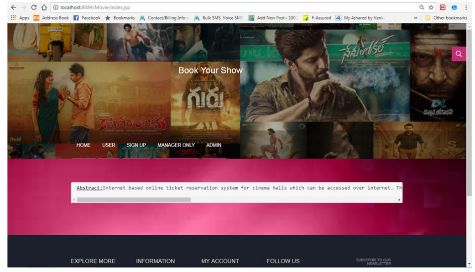
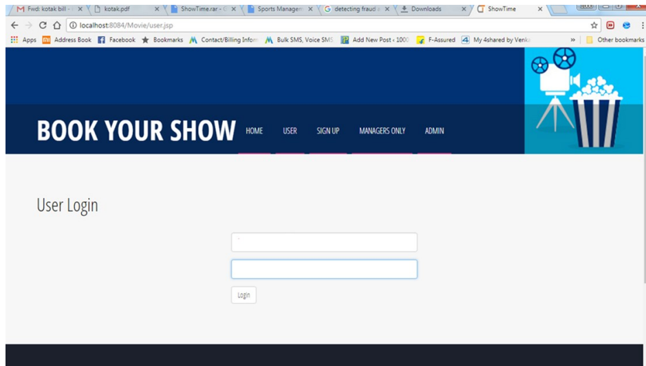
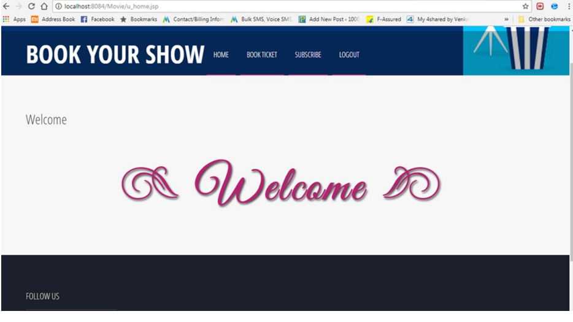
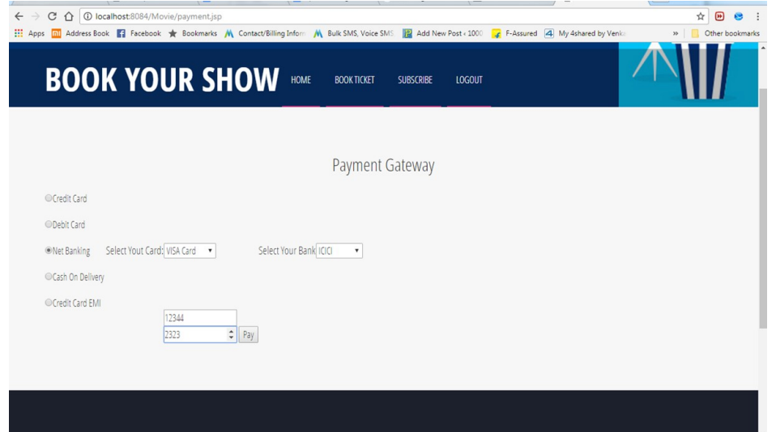

<h2 align="center">My Movie Plan</h2>
  An online movie ticket booking platform built with Angular, Spring Boot, and MySQL. Secure user authentication via JWT, with seamless browsing and booking of movies. Developed in TypeScript with Angular for the frontend, and Spring Data JPA for database management, ensuring a robust and dynamic experience through RESTful APIs powered by Spring Web.

 

### Demo Screeshots

 

 

 

